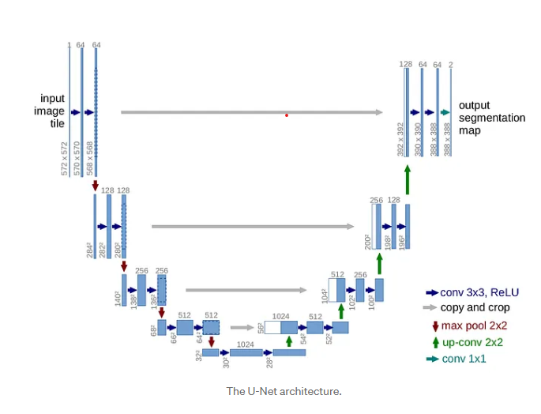

# U-net 

### A work in progress as I learn about convolutional neural networks and the UNet architechture to denoise or defog images.  

- Dataset - Flickr30k
- Learning rate - 1e-4
- Batch size - 32
- Optimizer - Adam
- Loss function - MSE Loss

### Using Weights and Biases (wandb.ai) to track and log experiments - it's awesome.